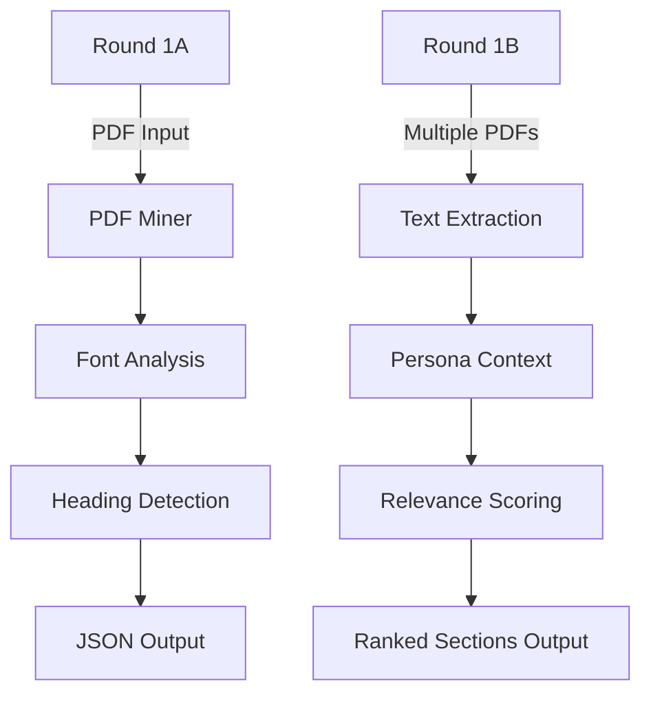

# Adobe India Hackathon: Connecting the Dots

## 📌 Overview

This repository contains solutions for **Round 1A** and **Round 1B** of the Adobe India Hackathon 2025, focusing on transforming PDF documents into intelligent, interactive experiences.

## 🏆 Challenge Summary

### Round 1A: Understand Your Document
**Objective**: Extract structured outlines (Title, H1, H2, H3 headings) from PDFs with page numbers  
**Key Requirements**:
- Process PDFs up to 50 pages in ≤10 seconds
- Output JSON with hierarchical structure
- Offline CPU-only execution (≤200MB model size)

### Round 1B: Persona-Driven Document Intelligence
**Objective**: Build an intelligent document analyst that extracts relevant sections based on specific personas  
**Key Requirements**:
- Process 3-10 related PDFs in ≤60 seconds
- Rank sections by importance to persona/job
- Offline CPU-only execution (≤1GB model size)

## 🛠️ Solution Architecture

## 📂 Repository Structure

adobe-hackathon/
├── round1a/
│   ├── extract_outline.py       # Main extraction script
│   ├── Dockerfile              # Container configuration
│   └── requirements.txt        # Dependencies
├── round1b/
│   ├── persona_analysis.py     # Persona analysis script
│   ├── Dockerfile              # Container configuration
│   └── requirements.txt        # Dependencies
├── samples/                    # Sample input/output files
├── README.md                   # This file
└── approach_explanation.md     # Detailed methodology

## Round 1A: Installation & Execution

# Build the Docker image
docker build --platform linux/amd64 -t pdf-outline-extractor -f round1a/Dockerfile .

# Run the container
docker run --rm \
  -v ${pwd}/input:/app/input \
  -v ${pwd}/output:/app/output \
  --network none \
  pdf-outline-extractor

## Round 1B: Installation & Execution

# Build the Docker image
docker build --platform linux/amd64 -t persona-analyzer -f round1b/Dockerfile .

# Run with persona parameters (example)
docker run --rm \
  -v ${pwd}/input:/app/input \
  -v ${pwd}/output:/app/output \
  --network none \
  persona-analyzer \
  --persona "Investment Analyst" \
  --job "Analyze revenue trends and market positioning"

